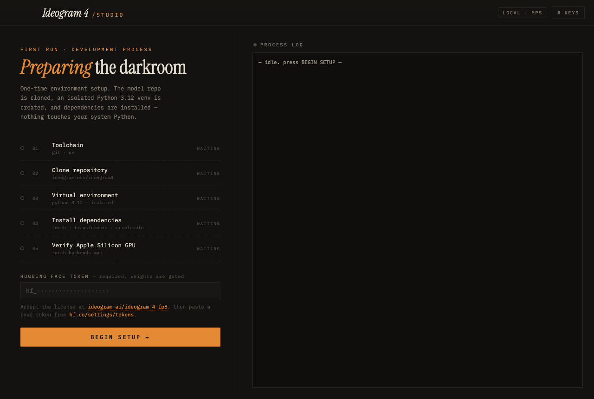

# Ideogram 4 Studio

A macOS desktop app that runs [ideogram-oss/ideogram4](https://github.com/ideogram-oss/ideogram4)
(Ideogram's open-weight 9.3B text-to-image model) **locally on Apple Silicon**, with fully
automatic environment setup.



## What it does

- **First-run setup wizard** — automatically:
  1. Finds `git` / `uv` (installs `uv` if missing)
  2. Clones the `ideogram4` repository
  3. Creates an isolated **Python 3.12 venv** (downloaded by `uv` — never touches system Python)
  4. Installs all dependencies (`torch`, `transformers`, `accelerate`, …)
  5. Verifies the Apple Silicon GPU (MPS) is visible to PyTorch
- **Generation studio** — prompt, width/height (256–2048, snapped to ×16), sampler preset,
  seed, live inference log, generated-image light table, and a contact-sheet history strip.
- Uses the **fp8** quantization (the nf4 variant is CUDA-only); device auto-selects **MPS**.

Everything lives under `~/Library/Application Support/ideogram4-studio/`
(repo clone, venv, outputs, config).

## Requirements

- Apple Silicon Mac with **≥ 32 GB RAM recommended** (9.3B DiT + Qwen3-VL-8B text encoder)
- Node.js 18+ (to run/build the app)
- A **Hugging Face token** — the weights are gated: accept the license at
  [ideogram-ai/ideogram-4-fp8](https://huggingface.co/ideogram-ai/ideogram-4-fp8) first
- Optional: an [Ideogram API key](https://developer.ideogram.ai/) for **magic prompt**
  expansion (without it the app passes `--no-magic-prompt`; the model was trained on
  structured JSON captions, so magic prompt noticeably helps plain-text prompts)

## Run

```bash
npm install
npm start
```

First generation downloads ~15–20 GB of model weights from Hugging Face; subsequent runs
use the local cache. Expect generation on an M-series GPU to take several minutes at
1024×1024 with `V4_QUALITY_48` (try `V4_TURBO_12` for faster drafts).

## Build a .app / .dmg

```bash
npm run dist   # output in dist/
```

## Dev flags

- `npx electron . --view=studio|setup` — force a view
- `npx electron . --screenshot=/tmp/out.png` — capture the window and quit
